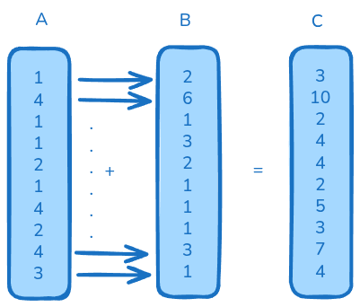

# Cuda Programming

Implementation of CUDA programs from the book: "Programming Massively Parallel Processors"

## Why CUDA?

- It leverages the parallel processing power of NVIDIA GPUs for high-performance computing.

## Task - Parallel Vector Addition



## Compile the CUDA program

```
nvcc vector_add.cu -i vector_add #generates executed output in vector_add
./vector_add
```
