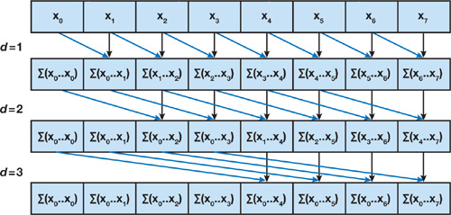

# Cuda Programming

Implementation of CUDA programs from the book: "Programming Massively Parallel Processors"

<!-- GitAds-Verify: 2YZIV9D1CW1GCHBR14RXRSFPURU7OVG1 -->

## Why CUDA?

- It leverages the parallel processing power of NVIDIA GPUs for high-performance computing.

### Watch on YouTube

[Master CUDA Programming: Zero to Hero](https://www.youtube.com/playlist?list=PLVVBQldz3m5v1VDhlCyB1DhPfjREsJWmf)

# Day 1

## Task - Parallel Vector Addition


## How to compile the CUDA program

```
nvcc vector_add.cu -i vector_add #generates executed output in vector_add
./vector_add
```

## How to run Cuda Program in Google Colab

**Steps**

1. Switch the Runtime type to GPU.
2. Check nvcc version and nvidia-smi.
3. Install and load nvcc4jupyter
4. Write your cuda Program.
5. Compile the CUDA program.
6. View the results.

# Day 2

## Write a CUDA program for Matrix Addition

Key Learning: How does a data structure gets mapped to threads in grid block?

Adding 2x2 matrix.


**2D Grid of Block**

We use the 2D properties of the CUDA grid and block to determine the row ($i$) and column ($j$) indices for the matrix:


**Matrix-Indices**


**Combining Thread to Matrix indices**


# Day 3

## Write a CUDA program for matrix-vector multiplication

Matrix-vector multiplication is an operation where a matrix and a vector are combined to produce a new vector. It's defined only when the number of columns in the matrix equals the number of rows (elements) in the vector. The resulting vector is a linear combination of the matrix's columns, where the components of the input vector act as the scalar coefficients.


**Index-wise Computation**


# Day 4

## Write a CUDA Program for Parallel Prefix Sum (Inclusive scan) algorithm

It computes the cumulative sum (or other associative binary operation) of elements in an array in parallel.

Given an input array:

```
[ a0, a1, a2, a3, ... , an ]
```

The inclusive prefix sum (scan) computes an output array as follows:

```
[ a0,
  a0+a1,
  a0+a1+a2,
  a0+a1+a2+a3, ... ]
```

So each output element i is the sum of all elements up to and including index i.



### **Why do we care?**

*Prefix sum powers many parallel algorithms: compaction, sorting, histogramming, polynomial evaluation, cumulative distributions, etc.*

### **Why Parallelization Matters?**

A sequential prefix sum requires O(n) steps:

```
out[i] = out[i-1] + in[i]
```
Each element depends on the previous one → inherently sequential.

The magic of parallel scan is transforming this dependency into a form that can be computed in O(log n) time using n processors, by restructuring the computation as a tree.

There are two-phases to Parallel Scan Algorithm

### **Phase 1: Upsweep**
Build a tree of partial sums.

Consider 8 elements:
```
Index: 0 1 2 3 4 5 6 7
Value: a b c d e f g h
```

**Step 0 (stride=1): Pairs of Two**

```
[ a, b, c, d, e, f, g, h ]
     ^     ^     ^
     b+=a  d+=c  f+=e  h+=g
```

**Step 1 (stride=2): Blocks of 4**

```
[ a, a+b, c, c+d, e, e+f, g, g+h ]
               ^            ^
               (a+b)+(c+d)  (e+f)+(g+h)
```

**Step 2 (stride=3): Block of 8**

```
root = (a+b+c+d) + (e+f+g+h)
```

Now we have a sum-reduction tree.

### **Phase 2: DownSweep**

Propagate partial sums back down the tree to compute prefix sums.

Before downsweep, set the root to 0 (for exclusive scan).
For inclusive scan, we simply adjust the last step or convert at the end.

In downsweep, each node passes its left child unchanged, and passes left+current to the right child.

Eventually, every index receives its correct prefix sum.

https://developer.nvidia.com/gpugems/gpugems3/part-vi-gpu-computing/chapter-39-parallel-prefix-sum-scan-cuda