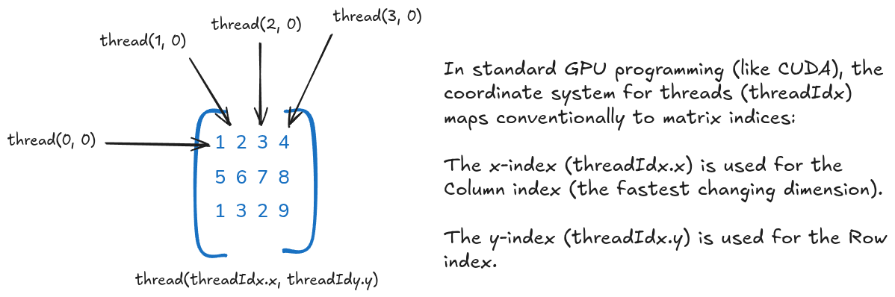

# Cuda Programming

Implementation of CUDA programs from the book: "Programming Massively Parallel Processors"

<!-- GitAds-Verify: 2YZIV9D1CW1GCHBR14RXRSFPURU7OVG1 -->

## Why CUDA?

- It leverages the parallel processing power of NVIDIA GPUs for high-performance computing.

## Task - Parallel Vector Addition


## Compile the CUDA program

```
nvcc vector_add.cu -i vector_add #generates executed output in vector_add
./vector_add
```

## How to run Cuda Program in Google Colab

**Steps**

1. Switch the Runtime type to GPU.
2. Check nvcc version and nvidia-smi.
3. Install and load nvcc4jupyter
4. Write your cuda Program.
5. Compile the CUDA program.
6. View the results.

## Write a CUDA program for Matrix Addition

Key Learning: How does a data structure gets mapped to threads in grid block?

Adding 2x2 matrix.


**2D Grid of Block**

We use the 2D properties of the CUDA grid and block to determine the row ($i$) and column ($j$) indices for the matrix:


**Matrix-Indices**


**Combining Thread to Matrix indices**

