# Cuda Programming

Implementation of CUDA programs from the book: "Programming Massively Parallel Processors"

**Follow the implementation on YouTube Playlist**

[Master CUDA Programming: From Zero to Hero](https://www.youtube.com/playlist?list=PLVVBQldz3m5v1VDhlCyB1DhPfjREsJWmf)

<!-- GitAds-Verify: 2YZIV9D1CW1GCHBR14RXRSFPURU7OVG1 -->

## Why CUDA?

- It leverages the parallel processing power of NVIDIA GPUs for high-performance computing.

# Day 1

## Task - Parallel Vector Addition


## How to compile the CUDA program

```
nvcc vector_add.cu -i vector_add #generates executed output in vector_add
./vector_add
```

## How to run Cuda Program in Google Colab

**Steps**

1. Switch the Runtime type to GPU.
2. Check nvcc version and nvidia-smi.
3. Install and load nvcc4jupyter
4. Write your cuda Program.
5. Compile the CUDA program.
6. View the results.

# Day 2

## Write a CUDA program for Matrix Addition

Key Learning: How does a data structure gets mapped to threads in grid block?

Adding 2x2 matrix.

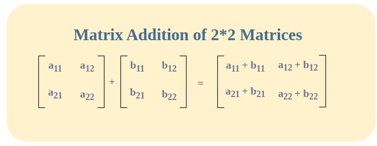

**2D Grid of Block**

We use the 2D properties of the CUDA grid and block to determine the row ($i$) and column ($j$) indices for the matrix:

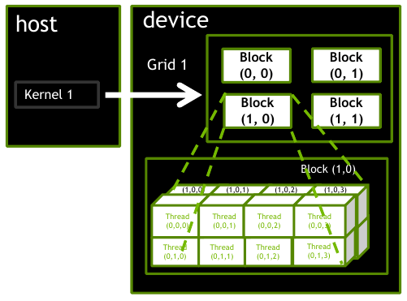

**Matrix-Indices**

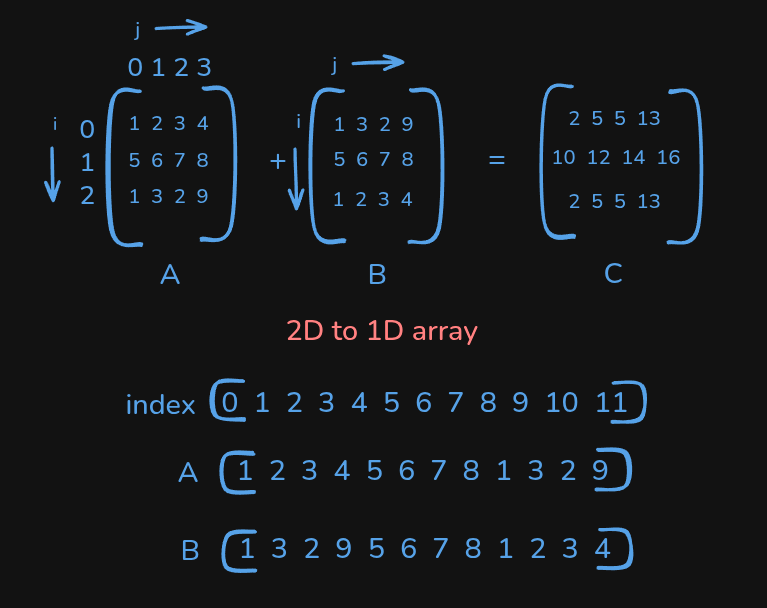

**Combining Thread to Matrix indices**


# Day 3

## Write a CUDA program for matrix-vector multiplication

Matrix-vector multiplication is an operation where a matrix and a vector are combined to produce a new vector. It's defined only when the number of columns in the matrix equals the number of rows (elements) in the vector. The resulting vector is a linear combination of the matrix's columns, where the components of the input vector act as the scalar coefficients.

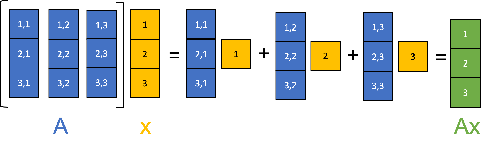

**Index-wise Computation**

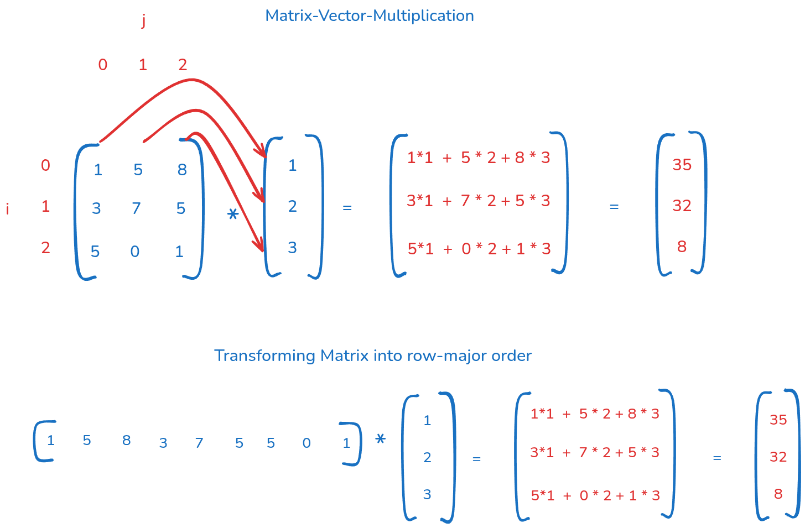

# Day 4

## Write a CUDA Program for Simplified Block-wise Prefix Sum 

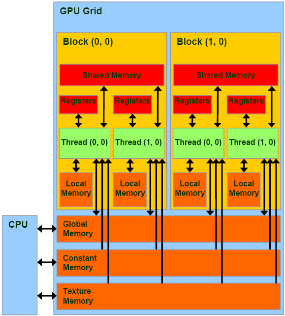


It computes the cumulative sum (or other associative binary operation) of elements in an array in parallel.

Given an input array:

```
[ a0, a1, a2, a3, ... , an ]
```

The inclusive prefix sum (scan) computes an output array as follows:

```
[ a0,
  a0+a1,
  a0+a1+a2,
  a0+a1+a2+a3, ... ]
```
So each output element i is the sum of all elements up to and including index i.

### **Why Parallelization Matters?**

A sequential prefix sum requires O(n) steps:

```
out[i] = out[i-1] + in[i]
```
Each element depends on the previous one → inherently sequential.

The magic of parallel scan is transforming this dependency into a form that can be computed in O(log n) time using n processors, by restructuring the computation as a tree.

### Implement a Simplified Block-wise Prefix Sum

It leverages CUDA capabilities to perform

     - Concurrent Execution: From O(n) to O(log n)
     - Shared Memory: Accessing results(partial sum) performed by other threads in previous iteration into current thread.
     - Coalesced Memory Access: Single thread reads multiple locations.

*Coalescing is a memory optimization technique where the GPU hardware automatically combines multiple small memory requests from a group of threads (a warp) into a single, larger, and highly efficient memory transaction.*

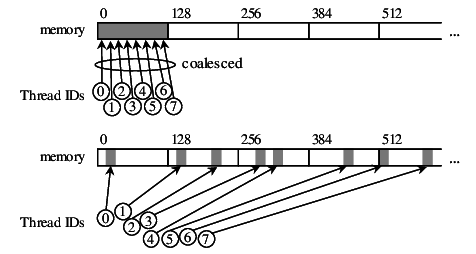

### Input and Kernel Configuration

**Input (h_input) = {1, 2, 3, 4, 5, 6, 7, 8, 9, 10, 11, 12, 13, 14, 15, 16}**

**Block Size (BlockDim.x) = 8 threads**

**Grid Size: 2 Blocks(block 0 handles indices 0-7 and block 1 handles indices 8-15)**

**Step 1: Initial Loading and Combine(Coalescing)**

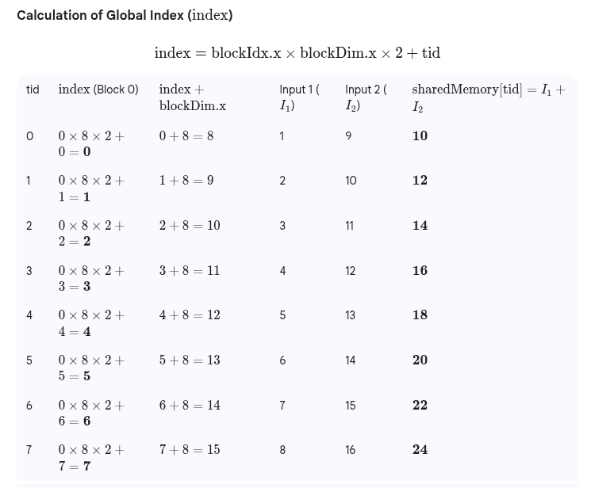

We store the results in the shared memory after loading.

**Step 2: Parallel Inclusive Scan**

Iterate through block of threads in a logarithmic loop.

`for (int stride=1; stride < BlockDim.x; stride *= 2)`

Iteration 1: *stride = 1*

if Thread with tid >= 1 read from (tid - 1)

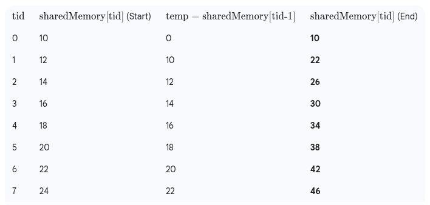


Iteration 2: *stride = 2*

if Thread with tid >= 2 read from (tid - 2)

Iteration 3: *stride = 4*

if Thread with tid >= 4 read from (tid - 4)

**Shared memory after scan**

S = {10, 22, 36, 52, 70, 90, 112, 136}

Step 3: **Write the shared memory to global memory**

# Day 5

## Write a CUDA program for Layer Normalization In a Neural Network (Transformer Architecture)

**Layer Normalization is a technique commonly used in Neural Networks (especially Transformers) to normalize the inputs across the features (columns) of an input sample (row).**

During neural network training, we use layer normalization to stabilise the training process.

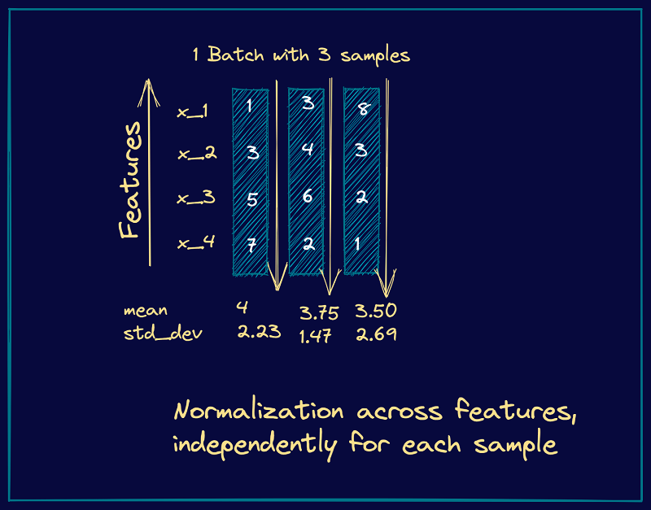

**2D into Row-Major Order**

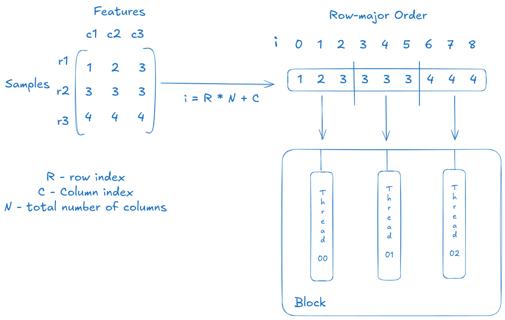

## 🌟 Sample 3x3 Layer Normalization Walkthrough

Let's assume the input matrix **A** (3 rows, 3 columns) is the following:

$$
\mathbf{A} = \begin{pmatrix}
1 & 2 & 3 \\
10 & 11 & 12 \\
0 & 0.5 & 1
\end{pmatrix}
$$

The Layer Normalization is applied **independently to each row** (sample) of the matrix.

---

### Row 1: (1, 2, 3)

The normalization steps (Mean, Variance, Normalize) are applied to the elements $\mathbf{A}_{1} = (1, 2, 3)$.

1.  **Calculate Mean ($\mu$):**
    $$
    \mu = \frac{1 + 2 + 3}{3} = \frac{6}{3} = \mathbf{2.0}
    $$
2.  **Calculate Variance ($\sigma^2$):**
    $$
    \sigma^2 = \frac{(1-2)^2 + (2-2)^2 + (3-2)^2}{3} = \frac{(-1)^2 + 0^2 + 1^2}{3} = \frac{1 + 0 + 1}{3} = \frac{2}{3} \approx \mathbf{0.6667}
    $$
3.  **Calculate Standard Deviation ($\sigma$):** (Ignoring the small $\epsilon=1\mathrm{e}{-7}$ for simplicity)
    $$
    \sigma = \sqrt{\sigma^2} = \sqrt{\frac{2}{3}} \approx \mathbf{0.8165}
    $$
4.  **Normalize (Output Row $\mathbf{B}_{1}$):**
    $$
    \mathbf{B}_{1} = \left(\frac{1-2}{0.8165}, \frac{2-2}{0.8165}, \frac{3-2}{0.8165}\right) \approx (-1.22, 0, 1.22)
    $$

---

### Row 2: (10, 11, 12)

The normalization steps are applied to the elements $\mathbf{A}_{2} = (10, 11, 12)$.

1.  **Calculate Mean ($\mu$):**
    $$
    \mu = \frac{10 + 11 + 12}{3} = \frac{33}{3} = \mathbf{11.0}
    $$
2.  **Calculate Variance ($\sigma^2$):**
    $$
    \sigma^2 = \frac{(10-11)^2 + (11-11)^2 + (12-11)^2}{3} = \frac{(-1)^2 + 0^2 + 1^2}{3} = \frac{2}{3} \approx \mathbf{0.6667}
    $$
3.  **Calculate Standard Deviation ($\sigma$):**
    $$
    \sigma = \sqrt{\frac{2}{3}} \approx \mathbf{0.8165}
    $$
4.  **Normalize (Output Row $\mathbf{B}_{2}$):**
    $$
    \mathbf{B}_{2} = \left(\frac{10-11}{0.8165}, \frac{11-11}{0.8165}, \frac{12-11}{0.8165}\right) \approx (-1.22, 0, 1.22)
    $$

---

### Row 3: (0, 0.5, 1)

The normalization steps are applied to the elements $\mathbf{A}_{3} = (0, 0.5, 1)$.

1.  **Calculate Mean ($\mu$):**
    $$
    \mu = \frac{0 + 0.5 + 1}{3} = \frac{1.5}{3} = \mathbf{0.5}
    $$
2.  **Calculate Variance ($\sigma^2$):**
    $$
    \sigma^2 = \frac{(0-0.5)^2 + (0.5-0.5)^2 + (1-0.5)^2}{3} = \frac{0.25 + 0 + 0.25}{3} = \frac{0.5}{3} \approx \mathbf{0.1667}
    $$
3.  **Calculate Standard Deviation ($\sigma$):**
    $$
    \sigma = \sqrt{\sigma^2} = \sqrt{\frac{0.5}{3}} \approx \mathbf{0.4082}
    $$
4.  **Normalize (Output Row $\mathbf{B}_{3}$):**
    $$
    \mathbf{B}_{3} = \left(\frac{0-0.5}{0.4082}, \frac{0.5-0.5}{0.4082}, \frac{1-0.5}{0.4082}\right) \approx (-1.22, 0, 1.22)
    $$

---

## Final Input and Output

### Sample Input Matrix $\mathbf{A}$ (Host Array `A` and Device Array `d_a`)
$$
\mathbf{A} = \begin{pmatrix}
1.00 & 2.00 & 3.00 \\
10.00 & 11.00 & 12.00 \\
0.00 & 0.50 & 1.00
\end{pmatrix}
$$

### Expected Output Matrix $\mathbf{B}$ (Host Array `B` and Device Array `d_b`)
$$
\mathbf{B} \approx \begin{pmatrix}
-1.22 & 0.00 & 1.22 \\
-1.22 & 0.00 & 1.22 \\
-1.22 & 0.00 & 1.22
\end{pmatrix}
$$

**Observation:** Notice that although the input rows had vastly different magnitudes (1 to 3 vs. 10 to 12), the output rows have the **same mean (0) and standard deviation (1)**, demonstrating how Layer Normalization scales the data to a uniform distribution within each row.

# Day 6

## Matrix Transpose

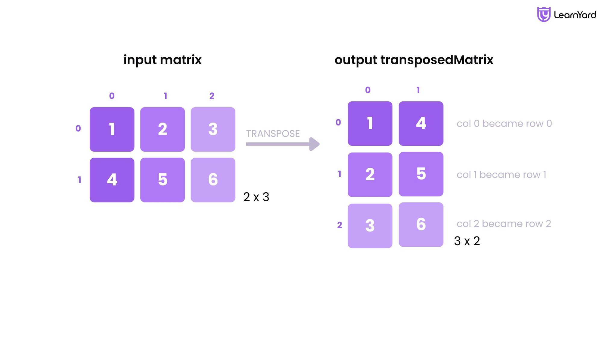

### **Mapping Thread to Matrix indices**


## Efficient Matrix Transpose using Tiling Strategy

**Issue with previous approach:**

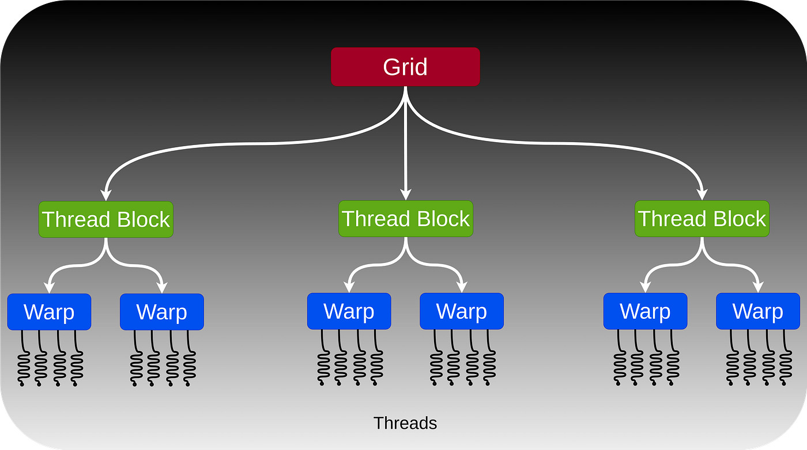

Reads (Coalesced): Threads in a warp (a group of 32 threads) usually have consecutive x values. In input[y * width + x], adjacent threads read adjacent memory addresses. This is fast (coalesced).

Writes (Uncoalesced): In output[x * height + y], adjacent threads (with consecutive x) write to memory addresses separated by height. This is a strided access pattern, which is very slow on GPUs because it requires many separate memory transactions.

Optimization Tip: Optimized CUDA transpose kernels typically use Shared Memory to tile the data, ensuring that both reads from global memory and writes to global memory are coalesced.

### **GPU tiling strategy**

**<span style="color: red;">It breaks large data (like matrices) into smaller "tiles" that fit into fast on-chip memory (shared memory/registers), reducing slow global memory accesses by reusing data locally, dramatically boosting performance for compute-intensive tasks like matrix multiplication by making kernels compute-bound instead of memory-bound. This involves threads loading tile data into shared memory, processing it, and then moving to the next tile, maximizing data locality and leveraging hardware like Tensor Cores for massive parallelism, with newer tools like CUDA Tile simplifying this for developers. </span>**

**Shared Memory and Global Memory**


### Core Concept: Memory Hierarchy Optimization

**<span style="color: green;">
Problem: GPUs have massive parallelism but limited bandwidth to main (global) memory. Naive algorithms repeatedly fetch data, bottlenecking performance.</span>**

**<span style="color: green;">Solution: Tiling loads small, relevant data chunks (tiles) into fast shared memory or registers.</span>**

**<span style="color: green;">Benefit: Threads within a thread block work on these local tiles, performing many computations before needing new data from global memory, achieving high arithmetic intensity. 
</span>**

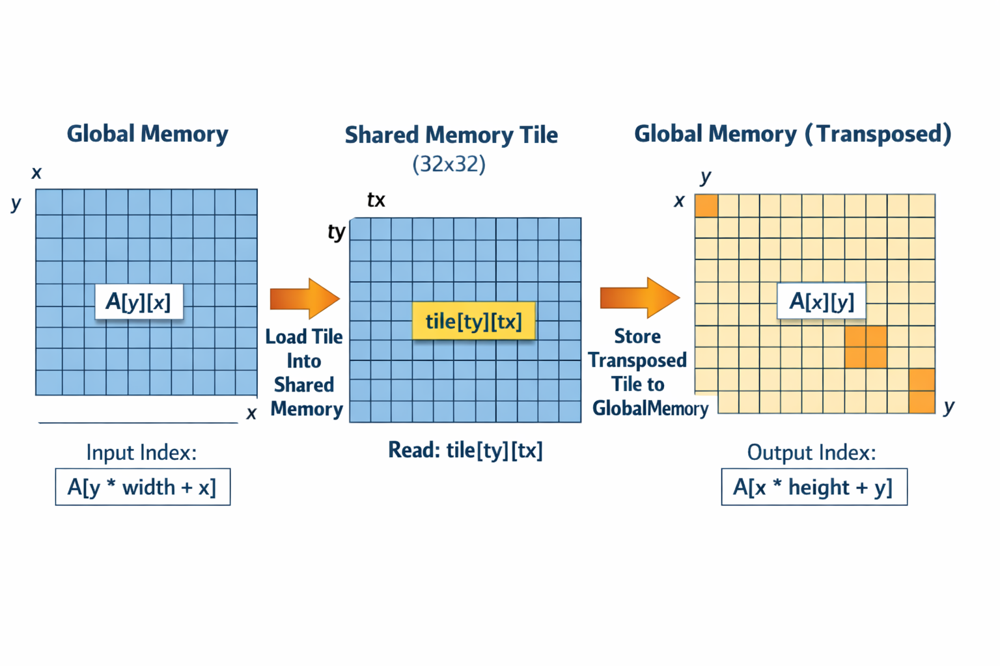

**How it Works (e.g., Matrix Multiplication)**

Partition Data: Input matrices A and B are divided into square tiles.

Load to Shared Memory: A thread block loads corresponding tiles of A and B into shared memory.

Compute Locally: Threads calculate partial results using shared memory data, often performing fused Multiply-Accumulate (MAC) 
operations.

Iterate: Threads move to the next set of tiles, repeating until the output tile is complete.

Specialized Hardware: On modern GPUs, tiles are further broken down (e.g., 4x4) for Tensor Cores, which process them in parallel. 

**Key Advantages**

- Reduced Global Memory Traffic: Significantly fewer reads from slow global memory.

- Improved Compute Utilization: Keeps compute units busy, making kernels compute-bound.

- Data Reuse: Data loaded into shared memory is reused multiple times.

- Portability: Frameworks like CUDA Tile aim to make tiling strategies portable across different GPU generations. 

**Modern Developments**

TileIR & CuTile: New compiler technologies to generate efficient, portable tiled code automatically, simplifying development.

Multi-level Tiling: Strategies for tiling across different memory levels (registers, shared, L1/L2 cache, HBM) for extreme optimization.

**Warp**

In NVIDIA GPUs, a warp is the fundamental execution unit, a group of 32 threads that execute the same instruction simultaneously (SIMT - Single Instruction, Multiple Threads) on different data, like a parallel for loop for 32 items, managed by the Streaming Multiprocessor (SM) to hide memory latency by switching between warps when one stalls. Programmers organize threads into blocks, which get divided into warps; sizing blocks as multiples of 32 (e.g., 128, 256 threads) is crucial for efficient resource use, avoiding partial warps that waste resources. 

Key Concepts:

- SIMT (Single Instruction, Multiple Threads): The core execution model; one instruction sent to all 32 threads in a warp, each with its own data.

- Warp Size: Always 32 threads on NVIDIA GPUs.

- Thread Block: A programmer-defined group of threads (e.g., 256, 512) that are further divided into warps by the hardware.

- Streaming Multiprocessor (SM): The GPU core that schedules and executes warps.

- Latency Hiding: If one warp stalls (e.g., waiting for memory), the SM quickly switches to another ready warp, keeping CUDA cores busy. 

How it Works:

- Grouping: Threads from a block are grouped into warps (32 threads each).

- Scheduling: The SM's scheduler picks warps to run.

- Execution: The warp executes instructions in lockstep. If threads diverge (take different if/else paths), the non-following threads are masked (deactivated) while the branch is taken, leading to inefficiency (warp divergence).

- Optimization: Choose thread block sizes (e.g., 128, 256, 512) that are multiples of 32 to fully utilize warp resources and minimize wasted threads in partial warps. 

**Why it Matters:**

**<span style="color: red;">
Understanding warps helps you write efficient CUDA code, ensuring your threads are grouped and executed optimally, preventing bottlenecks, and maximizing GPU parallelism.</span>**

**Tile Swap**

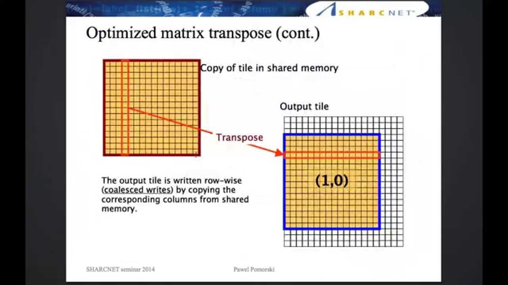

**Index Swap**

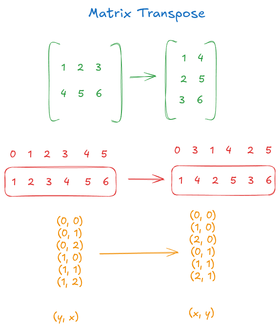

**Multi-Way Bank Conflict**

*It arises when multiple processing threads, executing simultaneously within a group known as a 
"warp" (NVIDIA) or "wavefront" (AMD), attempt to access different memory addresses that all 
map to the same underlying physical memory bank at the exact same time.*